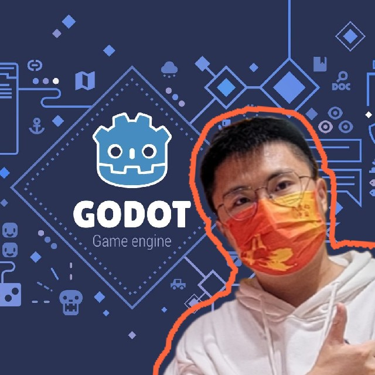

# GodotPlatform2D 教程项目

当前项目进入DEBUG阶段
itch.io试玩web：[https://godot-li.itch.io/platform2d](https://godot-li.itch.io/platform2d)

这是使用godot开发的系列教程demo的第 4 个。尽管很多同学表示对于2D平台跳跃游戏教程兴趣不大（笑）

【老李游戏学院】QQ频道：[https://pd.qq.com/s/n93zqynt](https://pd.qq.com/s/n93zqynt)
【老李游戏学院】知识星球：[https://t.zsxq.com/12B5zOA6n](https://t.zsxq.com/12B5zOA6n)

当前项目已经在gitee和github开源，欢迎star，开源地址：

[https://gitee.com/Giab/godot-platform-2d](https://gitee.com/Giab/godot-platform-2d)

[https://github.com/Liweimin0512/-GodotPlatform2D](https://github.com/Liweimin0512/-GodotPlatform2D)

后续计划在哔哩哔哩和youtube更新关于这个项目的视频教程。

后续教程项目都会采用这种形式开发。

感谢你的支持和理解！

本课程使用的素材：https://pixelfrog-assets.itch.io/pixel-adventure-1。

有条件的同学可以支持原作者。

## TODOList

- 玩家控制角色差异化设计
- 传送门
- 更多敌人和AI设计
- 更多场景trap
- 更多关卡设计
- 角色联网，合作通关
- 角色对抗玩法

## 游戏特色

- 使用godot4.2快速开发
- 绝对轻量级的完整游戏demo
- 多个关卡可切换，多个角色可选择
- 多种关卡trap实现
- 后续计划推出3D版本

​

​​​​

欢迎加入老李的知识付费平台：老李游戏学院（知识星球）

老李游戏学院

如果你觉得我工作不赖，也可以请我喝杯咖啡~

大家加油！
